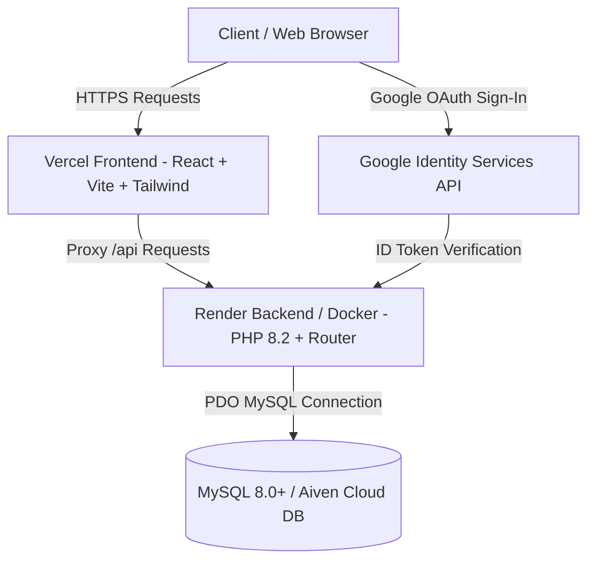

# 📖 คู่มือการติดตั้งและส่งมอบระบบ ThaiTrail (System Handover & Installation Manual)

ยินดีต้อนรับสู่คู่มือการติดตั้งและส่งมอบระบบ **ThaiTrail** แพลตฟอร์มแนะนำสถานที่ท่องเที่ยวอัจฉริยะในประเทศไทย เอกสารฉบับนี้จัดทำขึ้นเพื่อให้ทีมงานฝ่ายพัฒนาและผู้ดูแลระบบสามารถนำระบบไปติดตั้ง ใช้งาน พัฒนาต่อ และดูแลรักษาได้อย่างราบรื่น

---

## 📑 สารบัญ
1. [ภาพรวมระบบและสถาปัตยกรรม (System Overview & Architecture)](#1-ภาพรวมระบบและสถาปัตยกรรม)
2. [ความต้องการของระบบ (Prerequisites)](#2-ความต้องการของระบบ)
3. [โครงสร้างโฟลเดอร์ของโปรเจกต์ (Project Structure)](#3-โครงสร้างโฟลเดอร์ของโปรเจกต์)
4. [ขั้นตอนการติดตั้งระบบบนเครื่องเซิร์ฟเวอร์หรือ Local (Step-by-Step Installation)](#4-ขั้นตอนการติดตั้งระบบ)
5. [การตั้งค่า Google OAuth 2.0 (Google Authentication Setup)](#5-การตั้งค่า-google-oauth-20)
6. [การ Deploy บน Production (Vercel & Render / Docker)](#6-การ-deploy-บน-production)
7. [การทำงานของ Recommendation Engine (อัลกอริทึม 70/20/10)](#7-การทำงานของ-recommendation-engine)
8. [ตารางรายการ API (API Documentation)](#8-ตารางรายการ-api)
9. [การแก้ไขปัญหาเบื้องต้น (Troubleshooting FAQ)](#9-การแก้ไขปัญหาเบื้องต้น)

---

## 1. ภาพรวมระบบและสถาปัตยกรรม



- **Frontend**: พัฒนาด้วย **React (Vite)**, **Tailwind CSS**, และ **React Router Dom** มีระบบจัดการ State แบบ Context API (`AuthContext`, `CookieConsentContext`)
- **Backend**: พัฒนาด้วย **PHP 8.2 (RESTful Architecture)** ไม่ผูกมัดกับ Framework ขนาดใหญ่ เชื่อมต่อฐานข้อมูลผ่าน **PDO MySQL**
- **Database**: **MySQL 8.0+ / MariaDB** รองรับ UTF8MB4 ภาษาไทยเต็มรูปแบบ
- **Recommendation Engine**: ระบบคำนวณคะแนนพฤติกรรมผู้ใช้ (Dwell Time, Click, Like, Save, Share, Time Decay) และจัดสรรฟีดแนะนำ 24 สถานที่แบบ **70% หมวดหลัก / 20% หมวดรอง / 10% ค้นพบใหม่**

---

## 2. ความต้องการของระบบ (Prerequisites)

| ซอฟต์แวร์ / เครื่องมือ | เวอร์ชันขั้นต่ำ | วัตถุประสงค์ |
|---|---|---|
| **PHP** | 8.2 ขึ้นไป | ประมวลผล Backend API |
| **PHP Extensions** | `pdo`, `pdo_mysql`, `curl`, `mbstring`, `openssl`, `json` | ไดรเวอร์เชื่อมต่อและเข้ารหัส |
| **Node.js & npm** | Node >= 18.x, npm >= 9.x | Build & Run React Frontend |
| **MySQL / MariaDB** | MySQL 8.0+ / MariaDB 10.4+ | ฐานข้อมูลหลัก |
| **Docker (ทางเลือก)** | 20.x ขึ้นไป | สำหรับรัน Production Container |

---

## 3. โครงสร้างโฟลเดอร์ของโปรเจกต์

```text
ThaiTrail/
├── Dockerfile                  # คอนฟิก Docker สำหรับ Deploy Backend บน Cloud (Render)
├── vercel.json                 # คอนฟิก Vercel Routing และ API Reverse Proxy
├── database/                   # สคริปต์ฐานข้อมูล
│   ├── schema.sql              # โครงสร้างตารางทั้งหมดของระบบ
│   └── migrations/             # ไฟล์ Migration ประวัติการอัปเดตตาราง
├── backend/                    # ซอร์สโค้ดฝั่ง Backend (PHP)
│   ├── Dockerfile              # Dockerfile สำหรับโฟลเดอร์ backend
│   ├── router.php              # Router Script สำหรับ PHP Built-in Server
│   ├── config/
│   │   ├── database.php        # ตั้งค่าเชื่อมต่อฐานข้อมูล PDO
│   │   └── env.php             # ตัวอ่านค่าไฟล์ .env
│   ├── controller/
│   │   ├── AuthController.php            # จัดการ Register, Login, Google OAuth, Profile
│   │   ├── PlacesController.php          # ดึงรายการและรายละเอียดสถานที่ท่องเที่ยว
│   │   ├── RecommendationController.php  # อัลกอริทึมจัดฟีดแนะนำ 70/20/10
│   │   ├── SignalController.php          # บันทึกพฤติกรรม (คลิก, Dwell time, Like, Save)
│   │   └── UserInterestController.php    # จัดการความสนใจตอน Onboarding
│   ├── services/
│   │   ├── ScoreService.php              # คำนวณคะแนนสถานที่และ Time Decay
│   │   ├── MappingService.php
│   │   └── PlaceService.php
│   └── public/
│       └── index.php           # Entry Point หลักของ API ทั้งหมด
├── frontend/                   # ซอร์สโค้ดฝั่ง Frontend (React + Vite)
│   ├── package.json            # Node Dependencies
│   ├── vite.config.js          # คอนฟิก Vite & Local Proxy
│   └── src/
│       ├── App.jsx             # จุดรวม Route หลัก
│       ├── context/            # AuthContext, CookieConsentContext
│       ├── pages/              # หน้าเว็บ (Recommendations, Login, Onboarding ฯลฯ)
│       ├── components/         # คอมโพเนนต์ที่ใช้ซ้ำ (Navbar, PlaceCard, Footer ฯลฯ)
│       └── services/api.js     # API Client สำหรับสื่อสารกับ Backend
└── docs/                       # เอกสารระบบ
    └── HANDOVER_AND_INSTALLATION_MANUAL.md
```

---

## 4. ขั้นตอนการติดตั้งระบบ (Step-by-Step Installation)

### ขั้นตอนที่ 1: ติดตั้งฐานข้อมูล (Database Setup)
1. เปิดโปรแกรมจัดการฐานข้อมูล เช่น **phpMyAdmin**, **MySQL Workbench**, หรือ **DBeaver**
2. สร้าง Database ใหม่ เช่น `thai_trail_db` (กำหนด Collation เป็น `utf8mb4_unicode_ci`)
3. นำเข้าไฟล์ SQL จาก:
   ```bash
   database/schema.sql
   ```
4. ตารางหลักจะถูกสร้างขึ้นครบถ้วน (`users`, `places`, `categories`, `tourism_types`, `user_interests`, `user_preferences`, `user_place_scores`, `user_interactions`, `user_signals` ฯลฯ)

---

### ขั้นตอนที่ 2: ตั้งค่า Environment ของ Backend
1. สร้างไฟล์ `.env` ที่โฟลเดอร์หลักของโปรเจกต์ หรือในโฟลเดอร์ `backend/.env`
2. กำหนดค่าการเชื่อมต่อฐานข้อมูล:
   ```env
   DB_HOST=127.0.0.1
   DB_PORT=3306
   DB_NAME=thai_trail_db
   DB_USER=root
   DB_PASSWORD=your_password
   ```

---

### ขั้นตอนที่ 3: เริ่มต้นรัน Backend Server
เปิด Terminal ที่โฟลเดอร์ Root ของโปรเจกต์ แล้วรันคำสั่ง:
```bash
php -S localhost:8000 backend/router.php
```
เซิร์ฟเวอร์ Backend จะพร้อมทำงานที่ `http://localhost:8000`

---

### ขั้นตอนที่ 4: ติดตั้งและรัน Frontend
1. เปิด Terminal ใหม่ แล้วเข้าไปที่โฟลเดอร์ `frontend`:
   ```bash
   cd frontend
   ```
2. ติดตั้ง Dependencies:
   ```bash
   npm install
   ```
3. สร้างหรือตรวจสอบไฟล์ `frontend/.env`:
   ```env
   VITE_GOOGLE_CLIENT_ID=861431022222-fn8qm2bpv87blt8jr9l9kf1bas0mv7pt.apps.googleusercontent.com
   ```
4. รัน Dev Server:
   ```bash
   npm run dev
   ```
5. เปิดเว็บเบราว์เซอร์ที่ `http://localhost:5173`

---

## 5. การตั้งค่า Google OAuth 2.0 (Google Authentication)

1. เข้าไปที่ [Google Cloud Console](https://console.cloud.google.com/)
2. เลือกโปรเจกต์ -> ไปที่ **APIs & Services** -> **Credentials**
3. สร้าง **OAuth 2.0 Client ID** (Web application)
4. ระบุในช่อง **Authorized JavaScript origins**:
   - `http://localhost:5173` (สำหรับ Local)
   - `https://thaitrail.vercel.app` (สำหรับ Production)
5. นำ Client ID ที่ได้มากรอกใน `frontend/.env`:
   ```env
   VITE_GOOGLE_CLIENT_ID=<YOUR_GOOGLE_CLIENT_ID>
   ```

---

## 6. การ Deploy บน Production

### การ Deploy Frontend (Vercel):
1. นำ Repository ขึ้น GitHub
2. เข้าไปที่ [Vercel](https://vercel.com/) -> Import โปรเจกต์
3. ตั้งค่า:
   - **Root Directory**: `frontend`
   - **Framework Preset**: `Vite`
   - **Environment Variables**:
     - `VITE_GOOGLE_CLIENT_ID` = `<Client ID ของ Google>`
4. ไฟล์ `vercel.json` ที่ Root จะทำการ Route คำขอ `/api/*` ไปยัง Render Backend อัตโนมัติ

### การ Deploy Backend (Render):
1. เข้าไปที่ [Render](https://render.com/) -> New **Web Service**
2. เลือก Repository `ThaiTrail`
3. ตั้งค่า:
   - **Environment**: `Docker`
   - **Branch**: `main`
   - **Environment Variables**:
     - `DB_HOST` = `<Host ของฐานข้อมูล>`
     - `DB_PORT` = `<Port ของฐานข้อมูล>`
     - `DB_NAME` = `<ชื่อฐานข้อมูล>`
     - `DB_USER` = `<Username>`
     - `DB_PASSWORD` = `<Password>`

---

## 7. การทำงานของ Recommendation Engine

ระบบแนะนำสถานที่ของ ThaiTrail ขับเคลื่อนด้วยอัลกอริทึมจัดสรรสัดส่วน **70/20/10 Interleaved Algorithm**:

```text
ฟีดแนะนำสถานที่ 24 แห่ง (ต่อหน้า):
├── [70%] หมวดหมู่อันดับ 1 (Top Category): 17 แห่ง (ความสนใจหลักจาก Onboarding / ประวัติการดู)
├── [20%] หมวดหมู่อันดับ 2 (Second Category): 5 แห่ง (ความสนใจรอง)
└── [10%] ค้นพบสิ่งใหม่ (Discovery / Unseen): 2 แห่ง (สุ่มจากหมวดหมู่ที่คะแนนเป็น 0 / ยังไม่เคยดู)
```

### สูตรการคำนวณคะแนนสถานที่ (`ScoreService.php`):
$$\text{Score}(u, i) = 5.0(S) + 4.0(B) + 2.0(L) + 1.5 \cdot \ln(1 + T_{\text{cap}}) + 1.0 \cdot \ln(1 + C) + 2.0 \cdot \min\left(\frac{T}{E}, 1\right)$$
- $S, B, L$: แชร์, บันทึก, ถูกใจ (Binary 0 หรือ 1)
- $T$: เวลาที่อ่านหน้ารายละเอียดสถานที่จริง (Dwell time เป็นวินาที)
- $C$: จำนวนครั้งที่คลิกดูรายละเอียด (Click count)
- $E$: เวลาคาดหมายในการอ่านเนื้อหานั้น (Expected read time)

### การลดทอนคะแนนตามกาลเวลา (Time Decay):
คะแนนความสนใจของหมวดหมู่จะมีการลดทอนตามเวลาด้วยฟังก์ชัน Exponential Decay ($e^{-\lambda \cdot \Delta t}$) เพื่อให้สถานที่ที่เพิ่งได้รับความสนใจมีน้ำหนักมากกว่าสถานที่ที่เคยดูในอดีต

---

## 8. ตารางรายการ API (API Documentation)

| Method | Endpoint | คำอธิบาย | พารามิเตอร์หลัก / Header |
|---|---|---|---|
| `POST` | `/api/auth/register` | สมัครสมาชิกใหม่ | `name`, `email`, `password` |
| `POST` | `/api/auth/login` | เข้าสู่ระบบด้วยอีเมล/รหัสผ่าน | `email`, `password` |
| `POST` | `/api/auth/google` | เข้าสู่ระบบด้วย Google | `credential` (ID Token) |
| `GET` | `/api/auth/me` | ดึงข้อมูลผู้ใช้ปัจจุบัน | Session Cookie หรือ Header `X-User-Id` |
| `POST` | `/api/auth/logout` | ออกจากระบบ | - |
| `GET` | `/api/places` | ดึงรายการสถานที่ท่องเที่ยวทั้งหมด | `category_id` (ทางเลือก) |
| `GET` | `/api/recommendations` | ดึงฟีด 24 สถานที่แนะนำ (70/20/10) | `user_id`, `limit=24` |
| `GET` | `/api/user/interests` | ดึงรายการหมวดหมู่ความสนใจของผู้ใช้ | - |
| `POST` | `/api/user/interests` | บันทึกหมวดหมู่ความสนใจ (Onboarding) | `category_ids: [1, 2, ...]` |
| `POST` | `/api/signals` | บันทึกสัญญาณพฤติกรรม (Like, Save, Dwell) | `place_id`, `signal_type`, `dwell_seconds` |
| `GET` | `/api/user/profile` | ดึงข้อมูลโปรไฟล์ผู้ใช้ | - |
| `POST` | `/api/user/profile` | อัปเดตข้อมูลโปรไฟล์ผู้ใช้ | `name`, `avatar_url` |

---

## 9. การแก้ไขปัญหาเบื้องต้น (Troubleshooting FAQ)

### Q1: หน้าเว็บไม่แสดงภาพ หรือเกิด Error ในหน้าแนะนำสถานที่
- **วิธีแก้**: ตรวจสอบว่าตาราง `places`, `categories`, และ `tourism_types` มีข้อมูลครบถ้วน และเซิร์ฟเวอร์ Backend รันอยู่ที่ Port 8000 หรือ URL ที่ถูกต้อง

### Q2: ล็อกอินผ่าน Google แล้วขึ้น `origin_mismatch` (Error 400)
- **วิธีแก้**: นำ Domain ของเว็บ (เช่น `https://thaitrail.vercel.app`) ไปเพิ่มใน **Authorized JavaScript origins** บน Google Cloud Console ให้ครบถ้วน

### Q3: คุกกี้เซสชันหลุดเมื่อใช้งานข้ามโดเมน (Vercel -> Render)
- **วิธีแก้**: ระบบได้เพิ่ม Header Fallback (`Authorization: Bearer <user_id>` และ `X-User-Id`) ใน [`api.js`](file:///c:/Users/Rachata/OneDrive/Documents/GitHub/ThaiTrail/frontend/src/services/api.js) และ Backend รองรับการยืนยันตัวตนผ่าน Header และ Guest Mode โดยอัตโนมัติ

---

**ผู้จัดทำ**: ทีมพัฒนา ThaiTrail  
**วันที่ส่งมอบเอกสาร**: 14 กันยายน 2026
